# Active Directory Homelab

## Project Overview

This project demonstrates the deployment and administration of a Windows Server 2022 Active Directory environment in VMware Workstation.

The lab includes:

- Windows Server 2022 Domain Controller
- Active Directory Domain Services (AD DS)
- DNS Services
- Organizational Units (OUs)
- User and Group Management
- Security Group Administration
- Shared Folder Permissions
- Domain-Joined Windows 11 Client
- PowerShell Administration

---

## Network Diagram

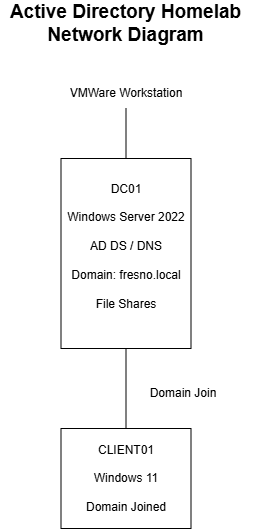

---

## Environment

### Domain Controller

- Hostname: DC01
- Operating System: Windows Server 2022
- Domain: fresno.local

### Client Workstation

- Hostname: CLIENT01
- Operating System: Windows 11 Pro
- Domain Joined: fresno.local

### Server Configuration

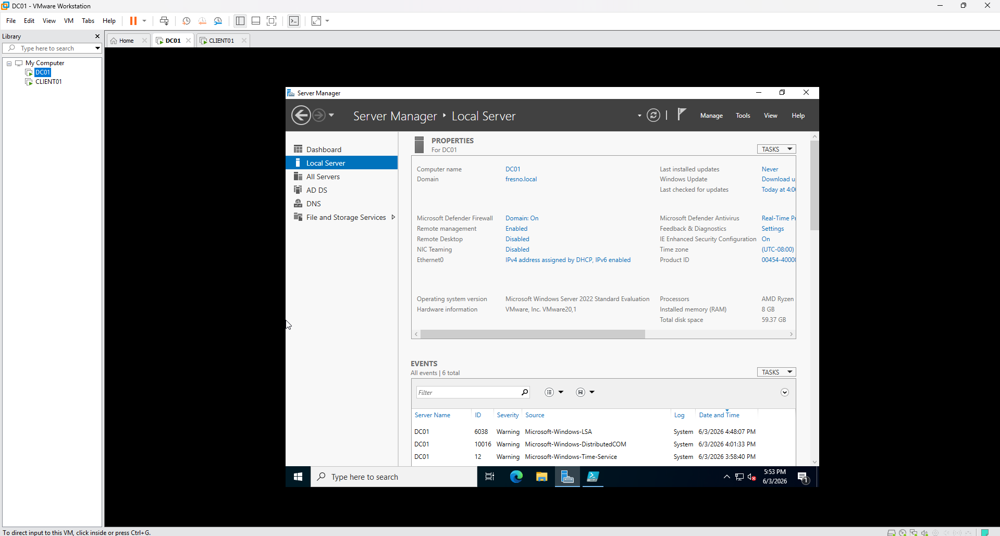

---

## Organizational Structure

The Active Directory environment was organized using a dedicated Organizational Unit structure.

### Organizational Units

- Users
- Groups
- Computers
- IT

### Users OU

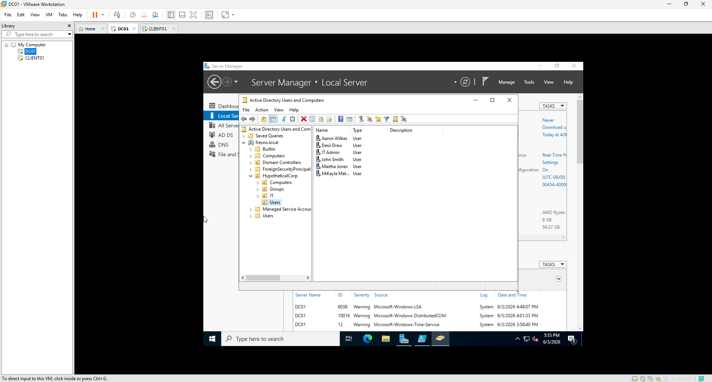

### Groups OU

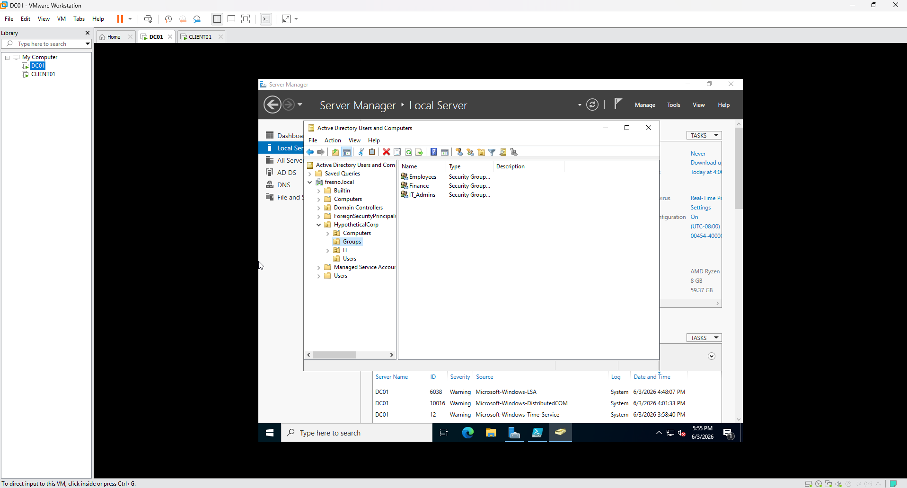

---

## User Account Management

Created and managed multiple domain user accounts:

- John Smith
- Martha Jones
- Aaron Wilkes
- Desii Drew
- MiKayla Mathis
- IT Admin

### User Accounts


---

## Security Groups

Three security groups were created to support role-based access control.

### Employees

Members:

- John Smith
- Martha Jones
- Aaron Wilkes
- Desii Drew
- MiKayla Mathis

### Finance

Members:

- Desii Drew

### IT_Admins

Members:

- IT Admin

### Security Groups Created


### Finance Group Membership

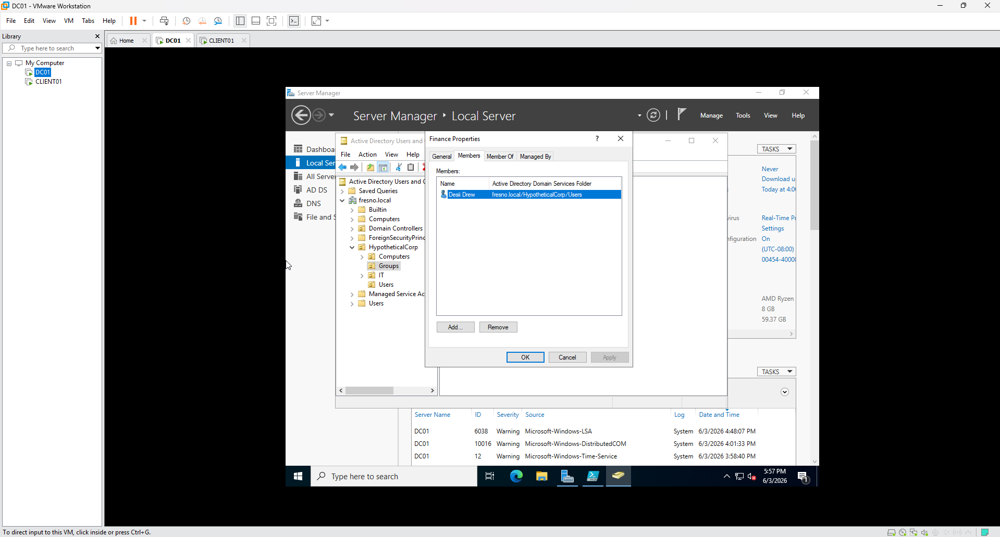

### Desii Drew Group Membership

Demonstrates membership in both Employees and Finance groups.

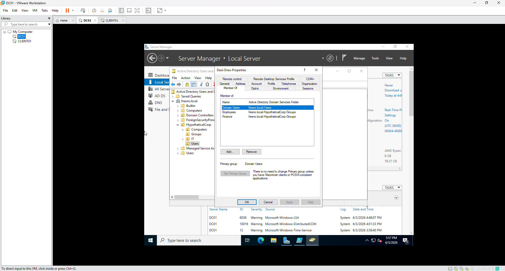

### Aaron Wilkes Group Membership

Demonstrates membership in the Employees group.

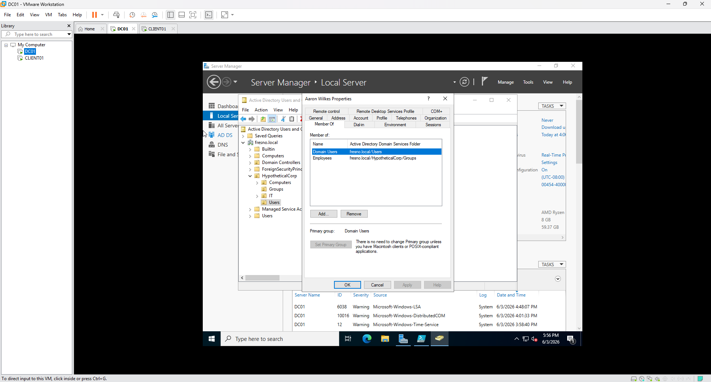

---

## Domain Join Validation

CLIENT01 was successfully joined to the Active Directory domain and authenticated using a domain user account.

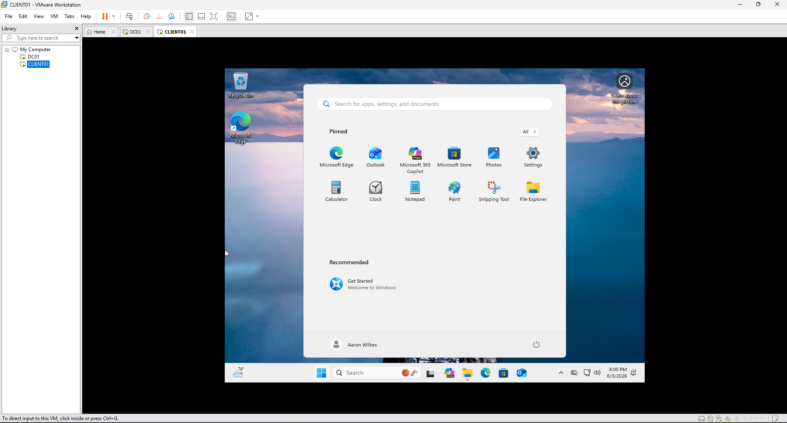

---

## Shared Resources

### Public Share

Purpose:

Accessible to all members of the Employees group.

Validation:

- John Smith successfully accessed
- Aaron Wilkes successfully accessed
- Desii Drew successfully accessed

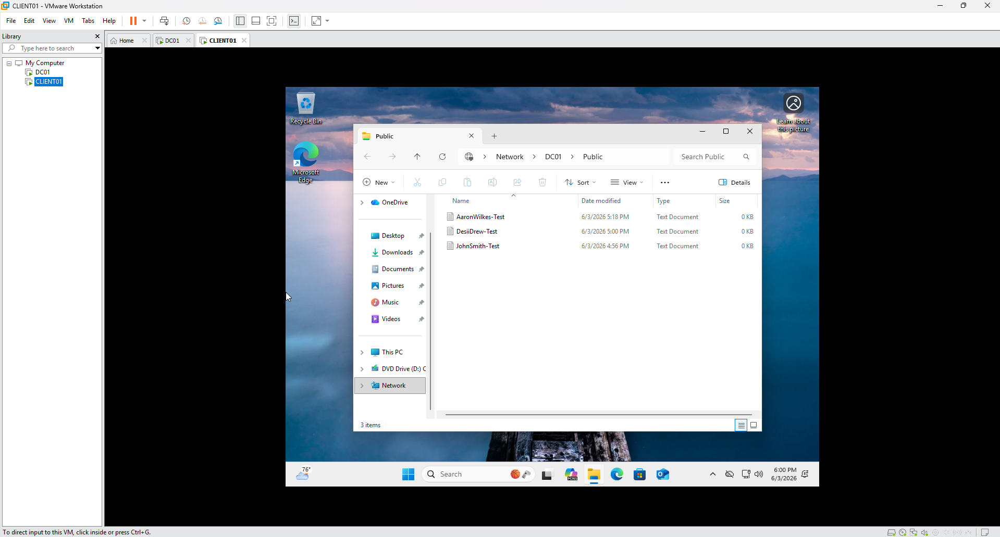

---

### Finance Share

Purpose:

Restricted to Finance group members only.

Validation:

- Desii Drew successfully accessed
- John Smith denied access
- Aaron Wilkes denied access

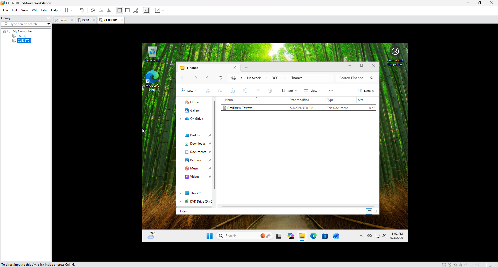

---

## PowerShell Administration

PowerShell was used to automate administrative tasks and validate group membership.

Example commands:

```powershell
Get-ADUser -Filter *
Get-ADGroupMember Employees
Get-ADGroupMember Finance
Add-ADGroupMember -Identity Employees -Members m.mathis
```

### PowerShell Verification

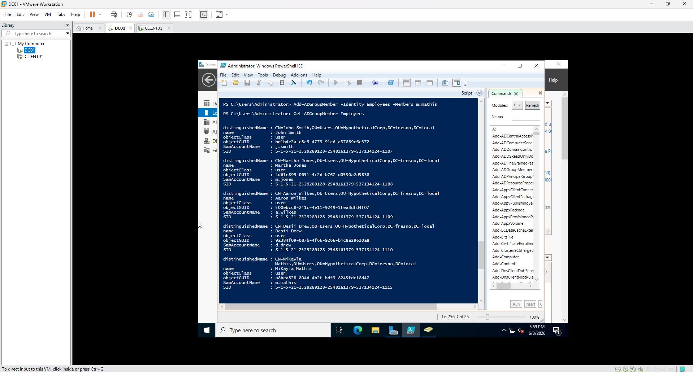

---

## Challenges Encountered

During deployment several issues were identified and resolved:

- Incorrectly configured share permissions on the CompanyShares parent folder
- NTFS inheritance conflicts requiring restoration of inherited permissions
- Windows 11 local account creation issues during setup
- File share access validation and troubleshooting
- Verification of Finance group access restrictions

These issues were resolved through Active Directory troubleshooting, permissions review, PowerShell validation, and end-user testing.

---

## Skills Demonstrated

- Active Directory Administration
- Windows Server 2022
- DNS Configuration
- Organizational Unit Design
- Security Group Management
- NTFS Permissions
- File Share Administration
- PowerShell Scripting
- Domain Join Operations
- Windows 11 Administration
- VMware Workstation
